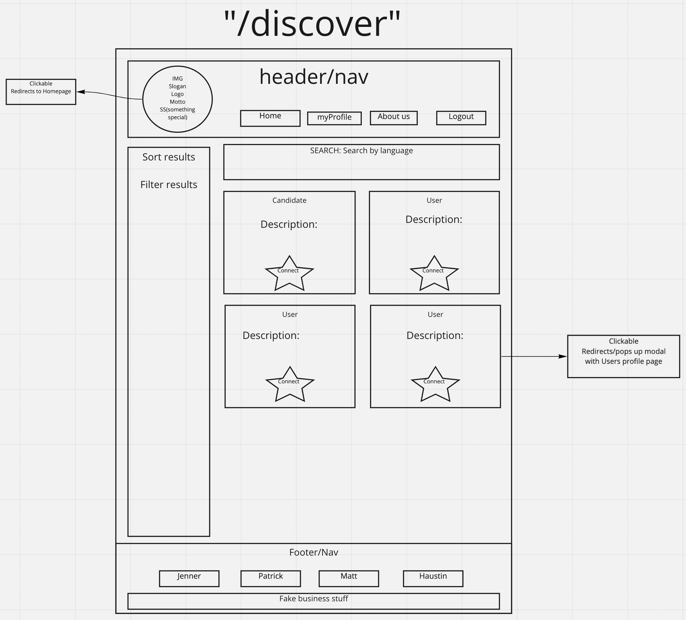
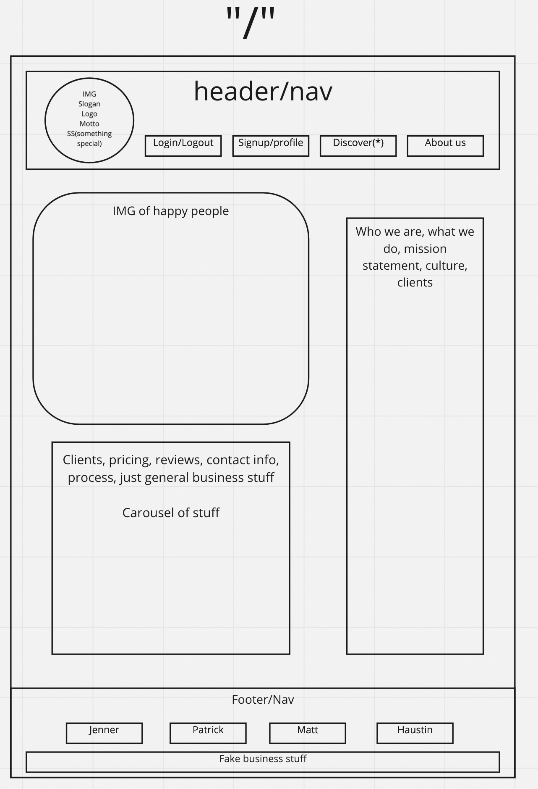
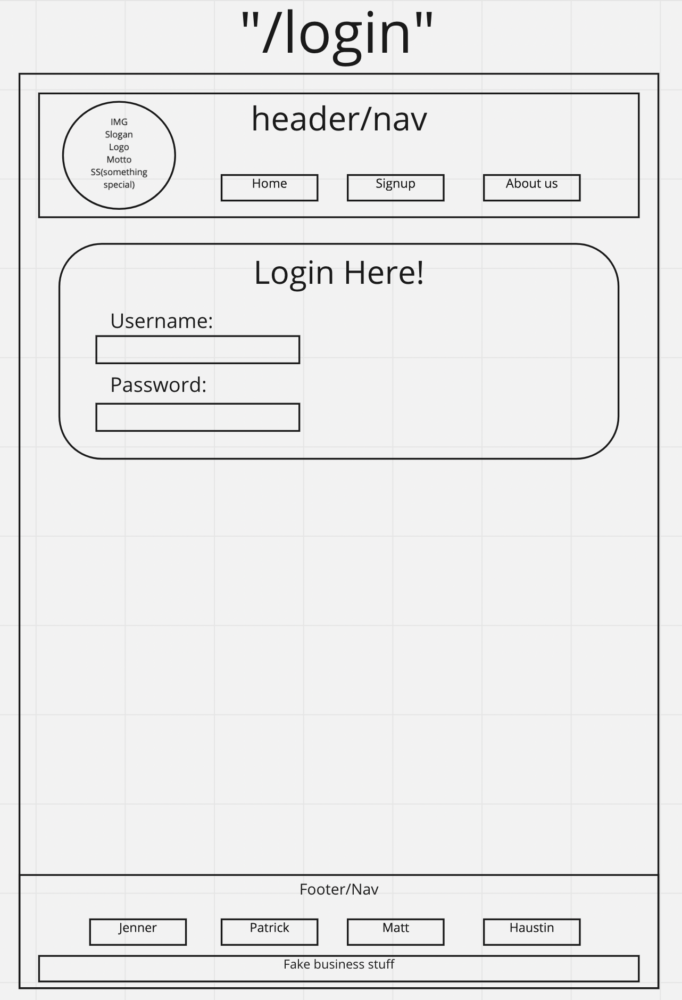
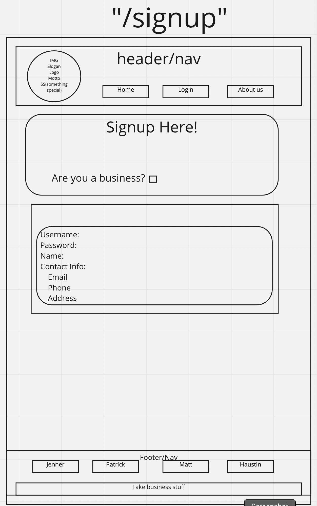
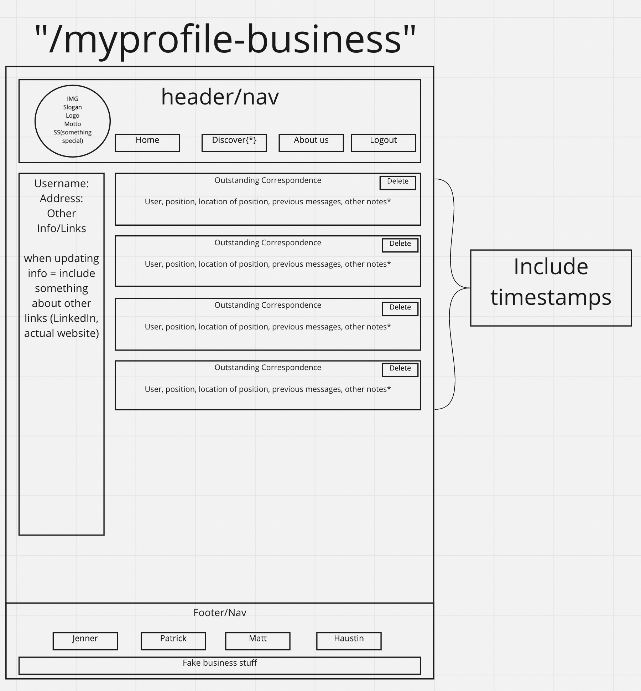
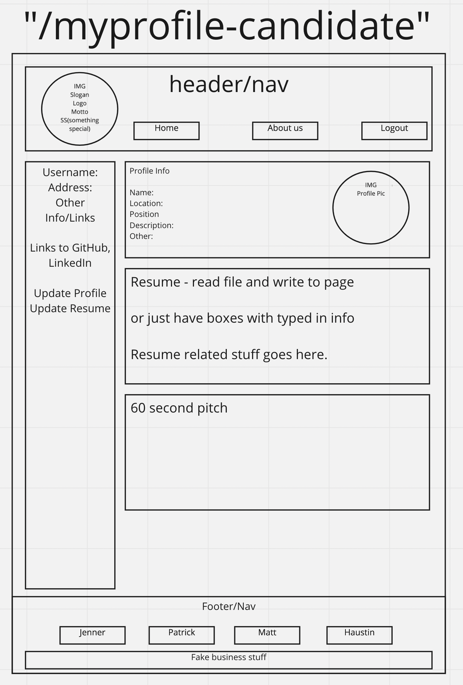
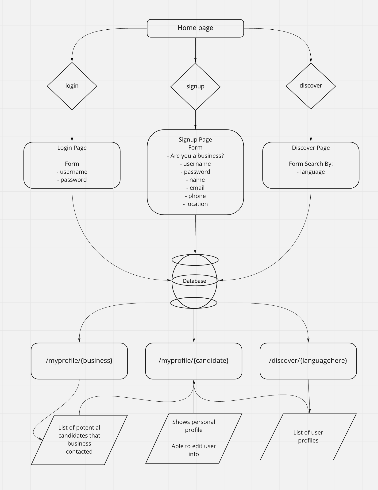
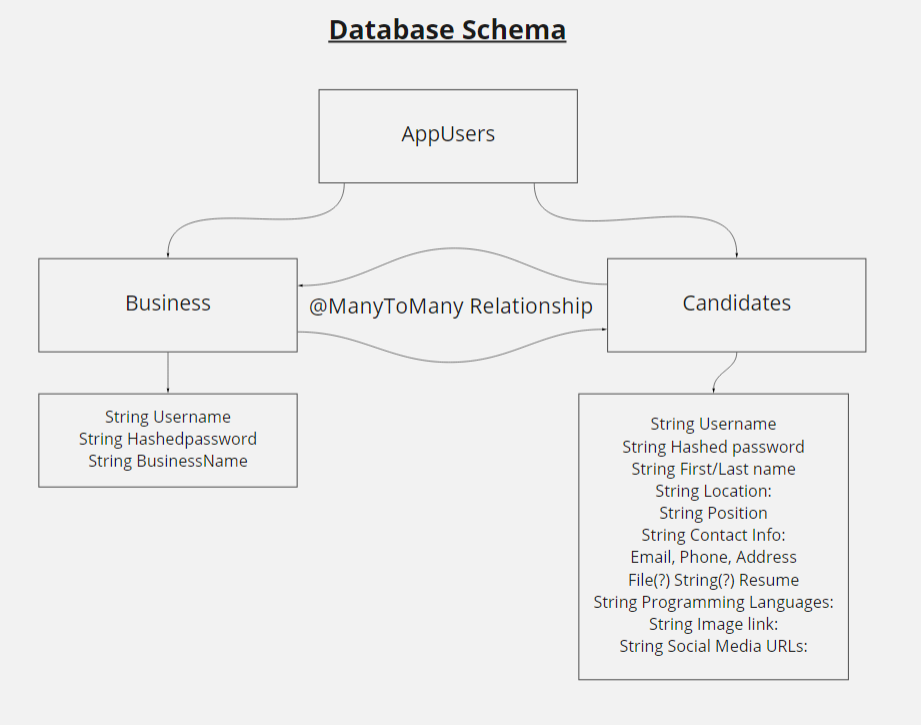

# EmployMee

## Team Members

Jenner Dulce, Haustin Kimbrough, Patrick Laurion, Matt Cho

## Summary

Recruiter based website/employment service, designed to connect employers with prospective employees. Employees display skill set on the site employers have capacity to search by keyword to find people based on their qualification.

## Wireframe

### Discover

### Index

### Login

### Sign Up

### Business Profile

### Candidate Profile

## User Stories

- As a hiring manager, I want a simple layout of potential employees, so that I can find qualified candidates more efficiently.
- As a startup looking for employees, I want a wide variety of job-seeking individuals, so that we can hire the best people.
- As a Jr. software developer, I want a way to display my skills/qualifications, so that companies can reach out to me for job opportunities.
- As a very successfully business, I want a way to filter potential candidates, so that I don't have to look through hundreds of resumes.
- As a business owner, I want a way to connect with prospecitve employees that meet my qualifications.

## Domain Modeling

## Database Schema

## Other

- [Team Agreement](./TeamAgreement.md)
- [Requirements](./requirements.md)

- Keep candidate information to a minimum
  - Years of experience
  - Programming language
  - Profile Id
- Business creates page
  - Capable of sending message to us (website employees)
  - website acts as a proxy relaying message from business to the candidate of interest
  - Message will contain business information and message from business
  - Candidate will have freedom to engage with business or not.
- Sign up
  - Are you a business yes / no
  - Create two separate sign up psages for candidate and businesses
- Lanagugaes
  - Add multipel